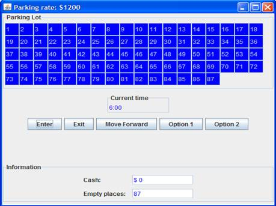

# Statement

An application that allows a user to manage a parking lot it is wanted here.
That parking lot has 87 parking places numbered from 1 to 87. In each place a car
can be parked. Parking lot has a parking rate per hour or fraction, each time the
government authorizes it.

Each car is identified by its number place, and each one has to know the arrival
time. This arrival time is a value between 6 and 20, because parking lot is open
from 6 am to 9 pm.

The application must: (1) Inform to an arriving car, the number of place in which
it has to be parked (if there are available places), (2) Inform to a car which
exits, the price to be paid, (3) Inform the parking lot manager the total
amount of money collected, (4) Inform the parking lot manager the number of
empty places. 

# Interfaz GUI

